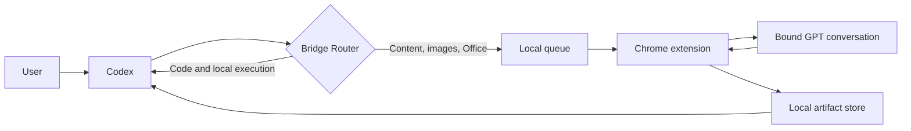

<p align="center">
  
</p>

<p align="center">
  <strong>Let Codex execute. Let GPT handle high-cost content work.</strong><br />
  A local, project-isolated bridge for Codex and GPT with file transfer and failure recovery.
</p>

<table align="center">
  <tr>
    <td width="50%" align="center"><strong>▣ Windows</strong><br /><sub>Validated in a real environment</sub></td>
    <td width="50%" align="center"><strong>◇ macOS</strong><br /><sub>Validated in a real environment</sub></td>
  </tr>
</table>

<p align="center">
  <strong>English</strong> ·
  <a href="README.md">简体中文</a> ·
  <a href="README.ru.md">Русский</a> ·
  <a href="README.ja.md">日本語</a> ·
  <a href="README.ko.md">한국어</a>
</p>

## Why chatgpt_codex_bridge

Codex is strong at reading projects, editing code, running commands, and verifying results. GPT is better suited to long-form writing, planning, visual judgment, images, and Office documents. Without a bridge, context and attachments must be copied between separate sessions, and failures are difficult to diagnose.

- **Codex handles local execution:** code, files, terminals, tests, and deployment.
- **GPT handles content-heavy work:** writing, design, images, Office/PDF, and complex attachments.
- **The router selects the executor:** users can still explicitly require Codex or GPT.
- **Results return to the same project:** text, images, and files retain project and task scope.
- **Failures are recoverable:** recapture a reply or collect only missing attachments without resending completed work.

## Core capabilities

| Capability | Description |
|---|---|
| Project-scoped binding | Each project binds its own GPT conversation, Codex task, and local directory |
| Automatic routing | Supports Codex-only, GPT-only, and GPT → Codex staged workflows |
| Bidirectional files | Text, images, PDF, DOCX, XLSX, PPTX, ZIP, and other common formats |
| Real artifact validation | File work succeeds only after a real file is captured |
| Multi-file recovery | Collect multiple files and recover only missing outputs |
| Stable reply identity | Does not depend on duplicated text or fragile array positions |
| Restart recovery | Continues waiting for an existing GPT task after a local service restart |
| Local persistence | Projects, messages, tasks, and artifacts remain in your own data directory |
| Fail-closed scope | Refuses work when the page, project, version, or Codex thread does not match |

## How it works



The system has four local components: the HTTP workbench on `127.0.0.1:4317`, a Chrome extension controlling only the bound GPT conversation, an MCP server for Codex, and a local project/artifact store. It does not require exporting ChatGPT cookies or uploading your project to a third-party bridge server.

## Installation

### Requirements

- Windows 10/11 or macOS, both validated in real environments
- Node.js 20 or newer
- Codex Desktop or Codex CLI
- Chrome or another Chromium browser
- A signed-in ChatGPT web session

### Give the release package to Codex (recommended)

1. Open [Releases](https://github.com/wangzhezbz/chatgpt-codex-bridge/releases/latest) and download `CodexBridge-User-Package-v0.1.95-*.zip`.
2. Attach the downloaded ZIP directly to Codex.
3. Send this instruction with the file:

   ```text
   Install this chatgpt_codex_bridge user package. Extract it to a permanent directory, keep the data directory outside the installation directory, start the local service, configure and reload the Codex MCP server, then verify that the HTTP, MCP, and extension versions match. Do not delete or overwrite my existing Bridge data.
   ```

4. Let Codex complete extraction, startup, and MCP configuration. You only need to load the Chrome extension as described below.

### Source installation

```powershell
git clone https://github.com/wangzhezbz/chatgpt-codex-bridge.git
cd chatgpt-codex-bridge
npm install
npm start
```

### Load the Chrome extension

1. Open `chrome://extensions/`.
2. Enable Developer mode.
3. Choose **Load unpacked**.
4. Select the package's `chrome-extension` directory.
5. Keep the GPT conversation you want to bind open.

<details>
<summary><strong>Advanced: expand for manual MCP configuration</strong></summary>

### Configure Codex MCP manually

Add the following to `~/.codex/config.toml` and replace the example paths:

```toml
[mcp_servers.chatgpt-codex-bridge]
command = "node"
args = ["D:/Apps/CodexBridge/src/mcp-server.js"]
enabled = true

[mcp_servers.chatgpt-codex-bridge.env]
BRIDGE_DATA_DIR = "D:/CodexBridgeData"
BRIDGE_STORE = "D:/CodexBridgeData"
BRIDGE_ROUTER_V2 = "1"
BRIDGE_GPT_TRANSPORT = "web-sync"
```

Keep the data directory outside the application directory so updates, rollback, or uninstall do not remove projects and messages. Reload `chatgpt-codex-bridge` in Codex after saving the configuration.

</details>

### First binding

1. Open your local project in Codex.
2. Open the local workbench.
3. Enter the project name, GPT conversation URL, and local project directory.
4. Select **Bind current session and enter**.
5. Confirm that the header reports GPT bound, connection ready, and rules written.

## Usage

### Everyday workflow: bind on the right, ask on the left

1. Open the project you want to work on in Codex on the left.
2. In Bridge on the right, enter the project name, GPT conversation URL, and local project directory, then bind.
3. Once the rules are written and the connection is ready, return to Codex and ask normally: `Have GPT analyze this file, then update the project using the result.`

Binding automatically creates or updates the Bridge sections in `AGENTS.md` and `BRIDGE.md` in your project directory, preserving existing project instructions. Use **Enter** for an existing binding. Use each project's own directory and GPT conversation. Task IDs, project IDs, and scope are internal parameters, not fields users need to fill in manually.

- Send ordinary requests from the workbench; the router selects Codex or GPT.
- Ask GPT to analyze a local file: `Send this PDF to GPT and list the key issues.`
- Ask GPT to generate a real file: `Create an Excel workbook from this data and return the file.`
- Create a staged workflow: `Draft the outline, write chapter one, then generate a poster; advance one stage at a time.`
- Override routing explicitly: `Do not send this to GPT; complete it locally in Codex.`

### Recovery actions

- **Recapture result:** inspect the original GPT reply without sending again.
- **Collect missing attachments:** preserve captured files and fetch only missing outputs.
- **Resend:** use only when the original request was not actually submitted.
- **Stop:** cancel the active Bridge task without silently resending it later.

## Data and security

- `BRIDGE_DATA_DIR` / `BRIDGE_STORE` controls the local data directory.
- Project, GPT conversation, and Codex thread scope must all match.
- The extension claims work only on the bound GPT page.
- Input uploads and generated outputs use separate capture scopes.
- State uses locked atomic writes and backups.
- Never publish cookies, API tokens, private project files, or `/api/config` credentials.

## Updates and removal

For an update, extract the new version into a new directory, point MCP and the Chrome extension at it, and keep using the same external data directory. To roll back, point both components back to the previous directory. To uninstall, stop the service, remove the extension and MCP entry, then remove the application directory; keep the data directory unless you intentionally want to discard history.

## Troubleshooting

| Symptom | Action |
|---|---|
| Workbench does not open | Confirm the service is running and port `4317` is available |
| Waiting for extension | Reload the extension and keep the bound GPT conversation open |
| GPT finished but no result appeared | Use **Recapture result** before resending |
| Only some files arrived | Use **Collect missing attachments** |
| MCP cannot find the project | Compare HTTP/MCP `dataRootId`, protocol version, and project scope |
| Version mismatch | Reload the service, extension, and MCP from the same release |

## Development

```powershell
npm install
npm test
npm run acceptance:contract
npm run package:user
npm run package:embedded
```

[MIT](LICENSE) © 2026 chatgpt_codex_bridge contributors
