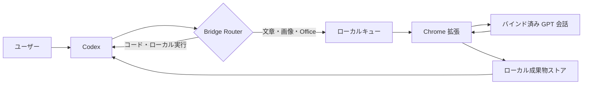

<p align="center">
  
</p>

<p align="center">
  <strong>ローカル実行は Codex、負荷の高いコンテンツ作業は GPT。</strong><br />
  プロジェクト分離、ファイル転送、障害復旧に対応したローカル連携ブリッジです。
</p>

<table>
  <tr>
    <td width="50%" align="center"><strong>▣ Windows</strong><br /><sub>実環境で検証済み</sub></td>
    <td width="50%" align="center"><strong>◇ macOS</strong><br /><sub>ソース実行対応 · 完全検証は今後実施</sub></td>
  </tr>
</table>

<p align="center">
  <a href="README.en.md">English</a> ·
  <a href="README.md">简体中文</a> ·
  <a href="README.ru.md">Русский</a> ·
  <strong>日本語</strong> ·
  <a href="README.ko.md">한국어</a>
</p>

## chatgpt_codex_bridge が必要な理由

Codex はプロジェクトの読解、コード編集、コマンド実行、結果検証に優れています。GPT は長文、企画、視覚判断、画像、Office 文書の処理に適しています。両者が別セッションのままだと、コンテキストや添付ファイルの手動コピーが必要になり、失敗時の状態も把握しにくくなります。

- **Codex がローカル作業を担当:** コード、ファイル、ターミナル、テスト、デプロイ。
- **GPT がコンテンツ作業を担当:** 長文、デザイン、画像、Office/PDF、複雑な添付解析。
- **Router が実行者を選択:** ユーザーによる Codex / GPT の明示指定も可能。
- **結果を同じプロジェクトへ返却:** テキスト、画像、ファイルのスコープを維持。
- **失敗から復旧:** 完了済みタスクを再送せず、回答の再取得や不足添付だけを回収。

## 主な機能

| 機能 | 内容 |
|---|---|
| プロジェクト単位のバインド | GPT 会話、Codex タスク、ローカルフォルダーをプロジェクトごとに分離 |
| 自動ルーティング | Codex-only、GPT-only、GPT → Codex の段階処理 |
| 双方向ファイル | テキスト、画像、PDF、DOCX、XLSX、PPTX、ZIP など |
| 実ファイル検証 | 実際のファイルを取得した場合のみ成功扱い |
| 複数添付と不足回収 | 複数ファイルを個別に取得し、不足分だけ再回収 |
| 安定した回答特定 | 同一文面や不安定な配列位置に依存しない |
| 再起動復旧 | ローカルサービス再起動後も元の GPT タスクを継続待機 |
| ローカル永続化 | プロジェクト、メッセージ、タスク、成果物を自身のデータ領域に保存 |
| フェイルクローズ | ページ、プロジェクト、バージョン、Codex スレッド不一致時は処理を拒否 |

## 仕組み



`127.0.0.1:4317` のローカルワークベンチ、バインド済み GPT 会話だけを操作する Chrome 拡張、Codex 用 MCP サーバー、ローカル成果物ストアで構成されます。ChatGPT Cookie の書き出しや、第三者 Bridge サーバーへのプロジェクト送信は不要です。

## インストール

### 必要環境

- Windows 10/11、またはソース実行用 macOS
- Node.js 20 以降
- Codex Desktop または Codex CLI
- Chrome などの Chromium ブラウザー
- ログイン済みの ChatGPT Web セッション

### Windows 向けリリースパッケージ

1. [Releases](https://github.com/wangzhezbz/chatgpt-codex-bridge/releases/latest) から `CodexBridge-User-Package-v0.1.95-*.zip` をダウンロードします。
2. `D:\Apps\CodexBridge` など固定フォルダーに展開します。
3. `INSTALL-CodexBridge.md` を読み、`Start-CodexBridge.cmd` を実行します。
4. `http://127.0.0.1:4317/` を開きます。

### ソースから実行

```powershell
git clone https://github.com/wangzhezbz/chatgpt-codex-bridge.git
cd chatgpt-codex-bridge
npm install
npm start
```

### Chrome 拡張の読み込み

1. `chrome://extensions/` を開き、デベロッパーモードを有効にします。
2. **パッケージ化されていない拡張機能を読み込む**を選びます。
3. `chrome-extension` フォルダーを指定します。
4. バインドする GPT 会話を開いたままにします。

### Codex MCP の設定

`~/.codex/config.toml` に追加し、パスを実際のものへ変更します。

```toml
[mcp_servers.chatgpt-codex-bridge]
command = "node"
args = ["D:/Apps/CodexBridge/src/mcp-server.js"]
enabled = true

[mcp_servers.chatgpt-codex-bridge.env]
BRIDGE_DATA_DIR = "D:/CodexBridgeData"
BRIDGE_STORE = "D:/CodexBridgeData"
BRIDGE_ROUTER_V2 = "1"
BRIDGE_GPT_TRANSPORT = "web-sync"
```

更新やロールバックで履歴を失わないよう、データフォルダーはアプリ本体の外に置いてください。保存後、Codex で `chatgpt-codex-bridge` MCP を再読み込みします。

### 初回バインド

1. Codex でローカルプロジェクトを開きます。
2. Bridge ワークベンチを開きます。
3. プロジェクト名、GPT 会話 URL、ローカルフォルダーを入力します。
4. 現在のセッションをバインドして入室します。
5. GPT バインド済み、接続準備完了、ルール書き込み済みであることを確認します。

## 使用方法

- 通常の依頼はワークベンチから送信し、Router に Codex / GPT を選択させます。
- ファイル解析: `この PDF を GPT に渡して重要な問題を整理してください。`
- ファイル生成: `このデータから Excel を生成し、実ファイルを返してください。`
- 段階処理: `構成、第一章、ポスターの順に、一度に一段階だけ進めてください。`
- 明示指定: `GPT に送らず、Codex でローカル実行してください。`

### 復旧操作

- **結果を再取得:** 元の GPT 回答を再確認し、プロンプトは再送しません。
- **不足添付を回収:** 取得済みファイルを保持し、不足分だけを取得します。
- **再送信:** 元の要求が送信されなかった場合だけ使用します。
- **停止:** 現在のタスクをキャンセルし、後から自動再送しません。

## データとセキュリティ

- データ保存先は `BRIDGE_DATA_DIR` / `BRIDGE_STORE` で指定します。
- プロジェクト、GPT 会話、Codex スレッドの三つが一致する必要があります。
- 拡張はバインド済み GPT ページのタスクだけを取得します。
- 入力ファイルと生成ファイルは別の取得スコープを使用します。
- 状態はロック付きアトミック書き込みとバックアップで保存します。
- Cookie、API Token、非公開ファイル、`/api/config` の認証情報を公開しないでください。

## 更新・ロールバック・削除

新バージョンを別フォルダーに展開し、MCP と Chrome 拡張の参照先だけを切り替えます。外部データフォルダーはそのまま使用します。ロールバック時は旧フォルダーへ戻します。削除時はサービス、拡張、MCP 設定、アプリフォルダーの順に処理し、履歴が不要な場合だけデータフォルダーを削除します。

## トラブルシューティング

| 症状 | 対処 |
|---|---|
| ワークベンチが開かない | サービスとポート `4317` を確認 |
| 拡張待機のまま | 拡張を再読み込みし、バインド済み GPT 会話を開く |
| GPT は完了したが結果がない | 再送前に「結果を再取得」を使用 |
| 一部ファイルだけ届いた | 「不足添付を回収」を使用 |
| MCP がプロジェクトを見つけない | `dataRootId`、プロトコル、プロジェクトスコープを比較 |
| バージョン不一致 | サービス、拡張、MCP を同じリリースから再読み込み |

## 開発

```powershell
npm install
npm test
npm run acceptance:contract
npm run package:user
npm run package:embedded
```

[MIT](LICENSE) © 2026 chatgpt_codex_bridge contributors
