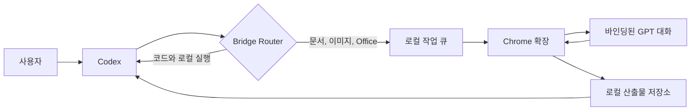

<p align="center">
  
</p>

<p align="center">
  <strong>로컬 실행은 Codex가, 고비용 콘텐츠 작업은 GPT가 담당합니다.</strong><br />
  프로젝트 격리, 파일 전달, 실패 복구를 지원하는 로컬 협업 브리지입니다.
</p>

<table align="center">
  <tr>
    <td width="50%" align="center"><strong>▣ Windows</strong><br /><a href="https://github.com/wangzhezbz/chatgpt-codex-bridge/releases/download/v0.1.95/CodexBridge-User-Package-v0.1.95-20260923-134443.zip">Windows용 다운로드 (ZIP)</a></td>
    <td width="50%" align="center"><strong>◇ macOS</strong><br /><a href="https://github.com/wangzhezbz/chatgpt-codex-bridge/releases/download/v0.1.95/CodexBridge-User-Package-v0.1.95-20260923-134443.zip">macOS용 다운로드 (ZIP)</a></td>
  </tr>
</table>

<p align="center">
  <a href="README.en.md">English</a> ·
  <a href="README.md">简体中文</a> ·
  <a href="README.ru.md">Русский</a> ·
  <a href="README.ja.md">日本語</a> ·
  <strong>한국어</strong>
</p>

## chatgpt_codex_bridge가 필요한 이유

Codex는 프로젝트 읽기, 코드 수정, 명령 실행, 결과 검증에 강합니다. GPT는 장문 작성, 기획, 시각 판단, 이미지, Office 문서 작업에 더 적합합니다. 두 도구가 분리되어 있으면 컨텍스트와 첨부 파일을 반복해서 복사해야 하고, 실패했을 때 실제 전송 상태를 확인하기 어렵습니다.

- **Codex가 로컬 작업 담당:** 코드, 파일, 터미널, 테스트, 배포.
- **GPT가 콘텐츠 작업 담당:** 장문, 디자인, 이미지, Office/PDF, 복잡한 첨부 분석.
- **Router가 실행자 선택:** 사용자가 Codex 또는 GPT를 명시적으로 지정할 수도 있습니다.
- **결과를 같은 프로젝트로 반환:** 텍스트, 이미지, 파일의 프로젝트 및 작업 범위를 유지합니다.
- **실패 복구:** 완료된 요청을 다시 보내지 않고 답변 또는 누락 첨부만 회수합니다.

## 핵심 기능

| 기능 | 설명 |
|---|---|
| 프로젝트 단위 바인딩 | 프로젝트마다 GPT 대화, Codex 작업, 로컬 폴더를 분리 |
| 자동 라우팅 | Codex-only, GPT-only, GPT → Codex 단계형 워크플로 지원 |
| 양방향 파일 | 텍스트, 이미지, PDF, DOCX, XLSX, PPTX, ZIP 등 |
| 실제 산출물 검증 | 실제 파일이 캡처된 경우에만 파일 작업 성공 처리 |
| 다중 첨부 복구 | 여러 파일을 개별 수집하고 누락된 결과만 추가 회수 |
| 안정적인 답변 식별 | 동일 문구나 변하기 쉬운 배열 위치에 의존하지 않음 |
| 재시작 복구 | 로컬 서비스 재시작 후 기존 GPT 작업을 계속 대기 |
| 로컬 영속성 | 프로젝트, 메시지, 작업, 산출물을 사용자 데이터 폴더에 저장 |
| 실패 안전 범위 | 페이지, 프로젝트, 버전, Codex 스레드가 다르면 작업 거부 |

## 작동 방식



`127.0.0.1:4317`의 로컬 워크벤치, 바인딩된 GPT 대화만 제어하는 Chrome 확장, Codex용 MCP 서버, 로컬 프로젝트/산출물 저장소로 구성됩니다. ChatGPT 쿠키를 내보내거나 프로젝트를 제3자 Bridge 서버에 업로드할 필요가 없습니다.

## 설치

### 요구 사항

- Windows 10/11 또는 macOS, 두 플랫폼 모두 실제 환경 검증 완료
- Node.js 20 이상
- Codex Desktop 또는 Codex CLI
- Chrome 또는 Chromium 브라우저
- 로그인된 ChatGPT 웹 세션

### 릴리스 패키지를 Codex에 전달하기 — 권장 방식

1. [Releases](https://github.com/wangzhezbz/chatgpt-codex-bridge/releases/latest)에서 `CodexBridge-User-Package-v0.1.95-*.zip`을 다운로드합니다.
2. 다운로드한 ZIP을 그대로 Codex 작업에 첨부합니다.
3. 파일과 함께 다음 지시문을 보냅니다.

   ```text
   이 chatgpt_codex_bridge 사용자 패키지를 설치해 주세요. 고정 폴더에 압축을 풀고 데이터 폴더는 설치 폴더 밖에 두며, 로컬 서비스를 시작하고 Codex MCP를 설정한 뒤 다시 로드해 주세요. 마지막으로 HTTP, MCP, 확장 버전이 일치하는지 확인해 주세요. 기존 Bridge 데이터는 삭제하거나 덮어쓰지 마세요.
   ```

4. 압축 해제, 서비스 시작, MCP 설정은 Codex가 처리합니다. 사용자는 아래 절차에 따라 Chrome 확장만 로드하면 됩니다.

### 소스에서 실행

```powershell
git clone https://github.com/wangzhezbz/chatgpt-codex-bridge.git
cd chatgpt-codex-bridge
npm install
npm start
```

### Chrome 확장 로드

1. `chrome://extensions/`에서 개발자 모드를 켭니다.
2. **압축 해제된 확장 프로그램을 로드합니다**를 선택합니다.
3. `chrome-extension` 폴더를 지정합니다.
4. 바인딩할 GPT 대화를 열린 상태로 유지합니다.

<details>
<summary><strong>고급: MCP를 수동으로 설정할 때 펼치기</strong></summary>

### Codex MCP 수동 설정

`~/.codex/config.toml`에 다음 내용을 추가하고 경로를 실제 설치 경로로 바꿉니다.

```toml
[mcp_servers.chatgpt-codex-bridge]
command = "node"
args = ["D:/Apps/CodexBridge/src/mcp-server.js"]
enabled = true

[mcp_servers.chatgpt-codex-bridge.env]
BRIDGE_DATA_DIR = "D:/CodexBridgeData"
BRIDGE_STORE = "D:/CodexBridgeData"
BRIDGE_ROUTER_V2 = "1"
BRIDGE_GPT_TRANSPORT = "web-sync"
```

업데이트나 롤백 시 기록을 보호하도록 데이터 폴더는 애플리케이션 폴더 밖에 두십시오. 저장 후 Codex에서 `chatgpt-codex-bridge` MCP를 다시 로드합니다.

</details>

### 첫 바인딩

1. Codex에서 로컬 프로젝트를 엽니다.
2. Bridge 워크벤치를 엽니다.
3. 프로젝트 이름, GPT 대화 URL, 로컬 프로젝트 폴더를 입력합니다.
4. 현재 세션 바인딩 버튼을 누릅니다.
5. GPT 바인딩, 연결 준비, 규칙 기록 상태를 확인합니다.

## 사용법

### 일상 사용: 오른쪽에서 바인딩하고 왼쪽에서 요청

1. 왼쪽 Codex에서 작업할 프로젝트를 엽니다.
2. 오른쪽 Bridge에 프로젝트 이름, GPT 대화 링크, 로컬 폴더를 입력하고 바인딩합니다.
3. 규칙 기록과 연결 준비 상태를 확인한 뒤 Codex로 돌아가 평소처럼 요청합니다. 예: `GPT에게 이 파일을 분석하게 하고 결과에 따라 프로젝트를 수정해 주세요.`

바인딩하면 프로젝트 폴더의 `AGENTS.md`와 `BRIDGE.md`에 Bridge 규칙을 자동 생성하거나 갱신하며 기존 프로젝트 설명은 보존합니다. 기존 바인딩은 목록에서 입장 버튼을 누르면 됩니다. 프로젝트마다 해당 폴더와 GPT 대화를 사용하세요. 작업 ID, 프로젝트 ID, scope는 내부 연결 값이므로 사용자가 직접 입력할 필요가 없습니다.

- 일반 요청은 워크벤치에서 보내고 Router가 Codex 또는 GPT를 선택하게 합니다.
- 파일 분석: `이 PDF를 GPT에 전달하고 핵심 문제를 정리해 주세요.`
- 파일 생성: `이 데이터로 Excel을 만들고 실제 파일을 반환해 주세요.`
- 단계형 작업: `개요, 1장, 포스터 순서로 한 번에 한 단계씩 진행해 주세요.`
- 명시적 지정: `GPT로 보내지 말고 Codex에서 로컬로 처리해 주세요.`

### 복구 작업

- **결과 다시 캡처:** 원래 GPT 답변만 다시 확인하며 요청은 재전송하지 않습니다.
- **누락 첨부 회수:** 이미 받은 파일은 유지하고 누락된 파일만 가져옵니다.
- **재전송:** 원래 요청이 실제로 전송되지 않은 경우에만 사용합니다.
- **중지:** 현재 작업을 취소하고 나중에 자동 재전송하지 않습니다.

## 데이터와 보안

- `BRIDGE_DATA_DIR` / `BRIDGE_STORE`가 로컬 데이터 폴더를 결정합니다.
- 프로젝트, GPT 대화, Codex 스레드 범위가 모두 일치해야 합니다.
- 확장은 바인딩된 GPT 페이지의 작업만 가져옵니다.
- 입력 업로드와 생성 결과는 별도 캡처 범위를 사용합니다.
- 상태 파일은 잠금 기반 원자적 쓰기와 백업으로 저장됩니다.
- 쿠키, API 토큰, 비공개 파일, `/api/config` 자격 증명을 공개하지 마십시오.

## 업데이트, 롤백, 제거

새 버전을 별도 폴더에 압축 해제하고 MCP와 Chrome 확장 경로만 전환하며, 기존 외부 데이터 폴더는 유지합니다. 롤백은 이전 폴더로 경로를 되돌립니다. 제거할 때는 서비스, 확장, MCP 항목, 애플리케이션 폴더 순서로 처리하고, 기록을 완전히 버릴 때만 데이터 폴더를 삭제합니다.

## 문제 해결

| 증상 | 해결 방법 |
|---|---|
| 워크벤치가 열리지 않음 | 서비스 실행과 `4317` 포트를 확인 |
| 확장 대기 상태 | 확장을 다시 로드하고 바인딩된 GPT 대화를 열어 둠 |
| GPT 완료 후 결과 없음 | 재전송 전에 결과 다시 캡처 사용 |
| 일부 파일만 수신 | 누락 첨부 회수 사용 |
| MCP가 프로젝트를 찾지 못함 | `dataRootId`, 프로토콜 버전, 프로젝트 범위 비교 |
| 버전 불일치 | 서비스, 확장, MCP를 같은 릴리스로 다시 로드 |

## 개발

```powershell
npm install
npm test
npm run acceptance:contract
npm run package:user
npm run package:embedded
```

[MIT](LICENSE) © 2026 chatgpt_codex_bridge contributors
