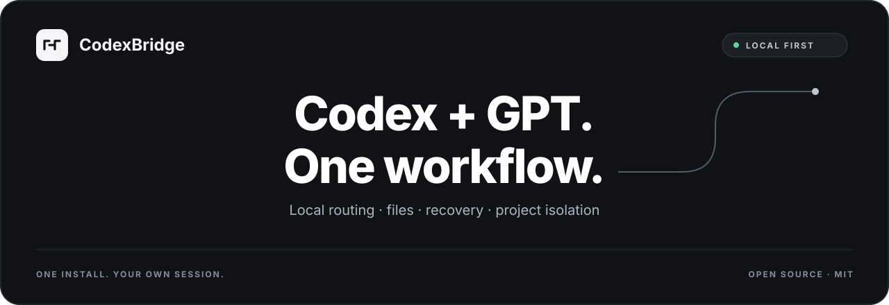
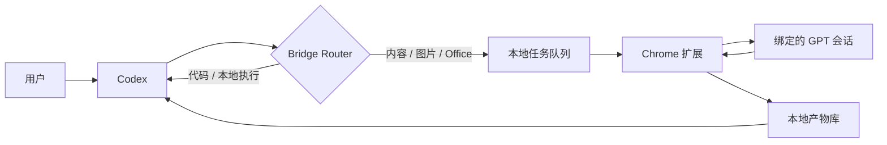
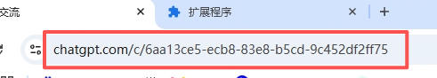
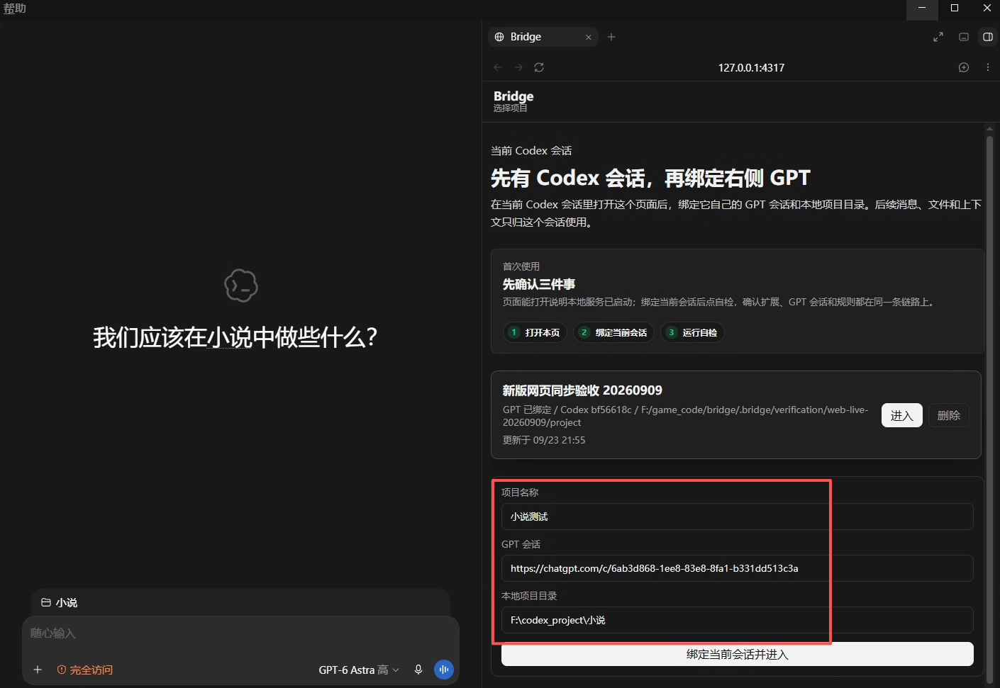

<p align="center">
  
</p>

<p align="center">
  <a href="https://github.com/wangzhezbz/chatgpt-codex-bridge/releases/latest"></a>
  
  
  
  <a href="LICENSE"></a>
</p>

<p align="center">
  <strong>让 Codex 负责执行，让 GPT 负责高成本内容工作。</strong><br />
  一个本地运行、按项目隔离、支持文件与失败恢复的 Codex × GPT 协作桥。
</p>

<table align="center">
  <tr>
    <td width="50%" align="center"><strong>▣ Windows</strong><br /><a href="https://github.com/wangzhezbz/chatgpt-codex-bridge/releases/download/v0.1.95/CodexBridge-User-Package-v0.1.95-20260923-134443.zip">下载</a></td>
    <td width="50%" align="center"><strong>◇ macOS</strong><br /><a href="https://github.com/wangzhezbz/chatgpt-codex-bridge/releases/download/v0.1.95/CodexBridge-User-Package-v0.1.95-20260923-134443.zip">下载</a></td>
  </tr>
</table>

<p align="center">
  <a href="README.en.md">English</a> ·
  <strong>简体中文</strong> ·
  <a href="README.ru.md">Русский</a> ·
  <a href="README.ja.md">日本語</a> ·
  <a href="README.ko.md">한국어</a>
</p>

<p align="center">
  <a href="#为什么需要-chatgpt_codex_bridge">为什么</a> ·
  <a href="#核心能力">核心能力</a> ·
  <a href="#工作原理">工作原理</a> ·
  <a href="#安装">安装</a> ·
  <a href="#使用">使用</a> ·
  <a href="#故障排查">故障排查</a> ·
  <a href="#开发与验证">开发</a>
</p>

https://github.com/user-attachments/assets/d207198f-c973-4fd4-963e-a656291068cc

## 为什么需要 chatgpt_codex_bridge

Codex 擅长读取项目、修改代码、运行命令和验证结果；GPT 更适合长文、策划、视觉判断、图片与 Office 文件生成。问题在于它们通常分处两个会话：上下文要手动复制，附件要反复上传，失败后也难以确认任务究竟有没有发送。

- **Codex 优先处理本地工作**：代码、文件、终端、测试、部署。
- **GPT 处理高成本内容任务**：长文、设计、图片、Office/PDF、复杂附件理解。
- **Router 自动选择执行者**：也支持用户明确指定“交给 GPT”或“只让 Codex 做”。
- **结果回到同一个项目**：文字、图片和文件都带有任务、项目和会话归属。
- **失败可恢复**：支持只重新收取结果、补收缺失附件，不必重复生成或重新发送。

## 核心能力

| 能力 | 说明 |
|---|---|
| 项目级绑定 | 每个 Bridge 项目绑定自己的 GPT 会话、Codex 任务和本地目录 |
| 自动路由 | 区分 Codex-only、GPT-only、GPT → Codex 多阶段任务 |
| 文件双向传递 | 支持文本、图片、PDF、DOCX、XLSX、PPTX、ZIP 等常见文件 |
| 真实产物验证 | 只有捕获到真实文件后才将文件任务视为成功 |
| 多附件与补收 | 多文件逐个收取；遗漏时只补收缺失文件，不重发原任务 |
| 稳定回复定位 | 使用稳定消息标识，不依赖相同文案或易变化的数组位置 |
| 断线恢复 | 本地服务短暂重启后，可继续等待原 GPT 任务 |
| 本地持久化 | 项目、消息、任务和产物保存在用户自己的数据目录 |
| 安全边界 | 仅控制绑定的 GPT 页面；版本、项目和线程不匹配时失败关闭 |

## 工作原理



chatgpt_codex_bridge 由四部分组成：

1. **本地服务**：默认监听 `127.0.0.1:4317`，保存项目、消息、任务和文件。
2. **Chrome 扩展**：只在绑定的 `chatgpt.com` 会话中发送任务、等待回复并收取产物。
3. **MCP 服务**：让当前 Codex 任务调用 Bridge，并强制携带项目、GPT 会话和 Codex 线程作用域。
4. **Bridge 工作台**：查看三方消息、连接状态、产物和恢复操作。

所有组件都在本机运行。chatgpt_codex_bridge 不要求导出 ChatGPT Cookie，也不会把本地项目上传到第三方 Bridge 服务器。

## 安装

### 环境要求

- Windows 10/11 或 macOS（均已完成真实环境验收）
- [Node.js](https://nodejs.org/) 20 或更新版本
- Codex 桌面版或 Codex CLI
- Chrome / Edge Chromium 浏览器
- 已登录的 ChatGPT 网页会话

### 方式一：把用户包交给 Codex（推荐）

1. 打开 [Releases](https://github.com/wangzhezbz/chatgpt-codex-bridge/releases/latest)，下载 `CodexBridge-User-Package-v0.1.95-*.zip`。
2. 把下载好的 ZIP 直接发送给 Codex。
3. 把下面这段话一起发给 Codex：

   ```text
   请安装这个 chatgpt_codex_bridge 用户包：解压到固定目录，把数据目录放在安装目录之外，启动本地服务，配置并重载 Codex MCP，然后检查 HTTP、MCP 和扩展版本是否一致。不要删除或覆盖我现有的 Bridge 数据。
   ```

4. 等 Codex 完成解压、启动和 MCP 配置。随后只需按下一节加载 Chrome 扩展。

### 方式二：从源码安装

```powershell
git clone https://github.com/wangzhezbz/chatgpt-codex-bridge.git
cd chatgpt-codex-bridge
npm install
npm start
```

源码安装适合开发者。普通用户优先使用 Release 用户包。

### 加载 Chrome 扩展

1. 打开 `chrome://extensions/`。
2. 开启“开发者模式”。
3. 点击“加载已解压的扩展程序”。
4. 选择安装目录中的 `chrome-extension` 文件夹。
5. 打开准备绑定的 ChatGPT 会话，并保持该页面存在。

扩展卡片应显示 `Codex GPT Bridge 0.1.95`。更新后，在扩展页面点击一次“重新加载”。

<details>
<summary><strong>高级：需要手动配置 MCP 时展开</strong></summary>

### 手动配置 Codex MCP

用户包内提供 `codex-mcp-config.toml`、`.mcp.json` 和 `Start-CodexBridge-MCP.cmd`。

完整人工安装说明见 `INSTALL-CodexBridge.md`，本地启动入口为 `Start-CodexBridge.cmd`；发布验收资料见 `ACCEPTANCE-CHECKLIST.md` 和 `REAL-BROWSER-ACCEPTANCE.md`。

配置模板中的入口写作 `<CodexBridge 安装目录>/src/mcp-server.js`；下面以 `D:/Apps/CodexBridge` 为例。

把下面配置加入 Codex 的 `~/.codex/config.toml`，并把路径替换为你的实际安装目录：

```toml
[mcp_servers.chatgpt-codex-bridge]
command = "node"
args = ["D:/Apps/CodexBridge/src/mcp-server.js"]
enabled = true

[mcp_servers.chatgpt-codex-bridge.env]
BRIDGE_DATA_DIR = "D:/CodexBridgeData"
BRIDGE_STORE = "D:/CodexBridgeData"
BRIDGE_ROUTER_V2 = "1"
BRIDGE_GPT_TRANSPORT = "web-sync"
```

建议把数据目录放在安装目录之外。这样升级、回滚或卸载程序时，不会删除项目和聊天记录。

保存后，在 Codex 的插件/MCP 设置中关闭再开启 `chatgpt-codex-bridge`。可用以下命令核对有效配置：

```powershell
codex mcp get chatgpt-codex-bridge --json
```

</details>

### 建立第一个绑定

1. 在 Codex 中打开你的本地项目。
2. 打开 Bridge 工作台 `http://127.0.0.1:4317/`。
3. 填写项目名称、目标 ChatGPT 会话链接和本地项目目录。

   <p align="center">
     
   </p>

   <p align="center">
     
   </p>

4. 点击“绑定当前会话并进入”。
5. 确认顶部状态为：**GPT 已绑定 / 连接就绪 / 规则已写入**。

绑定时会在你填写的项目目录中自动生成或更新 `AGENTS.md` 和 `BRIDGE.md` 的 Bridge 规则块，保留文件中已有的项目说明。

### 日常使用：右侧绑定，左侧提需求

安装完成后，日常只需要三步：

1. 在左侧 Codex 打开要工作的项目。
2. 在右侧 Bridge 填写项目名称、GPT 会话链接和本地项目目录，点击绑定。
3. 规则写入且连接就绪后，回到左侧 Codex 正常提需求，例如：“让 GPT 分析这份文件，再根据结果修改项目。”

已有绑定从项目列表点击“进入”即可。切换到其他项目时使用该项目自己的目录和 GPT 会话。任务 ID、项目 ID 和 scope 是内部关联参数，不需要用户手工填写。

## 使用

### 普通对话

直接在 Bridge 输入框发消息。Bridge 会根据内容选择 Codex 或 GPT，并在右侧显示真实执行状态。

### 让 GPT 分析本地文件

```text
把这个 PDF 交给 GPT 分析，列出关键问题。
```

Bridge 会上传本次指定文件，等待绑定的 GPT 会话返回，再把结果交回当前 Codex 任务。

### 让 GPT 生成文件

```text
让 GPT 根据这份数据生成一个 Excel，并保存到当前项目。
```

Bridge 只把实际捕获到的文件算作成功。如果 GPT 只写了文件名但没有真实下载，任务会显示失败而不是伪成功。

### 多阶段任务

```text
先让 GPT 设计三集小说大纲，再写第一章，最后生成海报；每次只推进一个阶段。
```

Router 会保留同一个运行记录，按依赖逐步提交。不会一次把所有阶段塞进同一条 GPT 请求。

### 明确指定执行者

```text
不要交给 GPT，这个修改由 Codex 本地完成。
```

```text
把这份文案交给 GPT 重写，不修改本地代码。
```

### 失败恢复

- **重新收取结果**：GPT 已经完成，只重新检查原回复，不重新发送。
- **补收缺失附件**：保留已收文件，只下载遗漏文件。
- **重新发送**：仅用于系统确认原请求没有真正发送的情况。
- **停止**：停止当前 Bridge 任务；后续恢复不会自动重发已取消流程。

## 数据、隐私与安全

- 默认数据目录由 `BRIDGE_DATA_DIR` / `BRIDGE_STORE` 决定。
- 项目、GPT 会话、Codex 线程三重作用域不匹配时，请求会被拒绝。
- 扩展只领取与当前绑定 GPT 页面匹配的任务。
- 用户上传文件和 GPT 生成文件使用不同的捕获范围，避免把输入附件当成输出。
- 状态文件采用带锁原子写入和备份，避免进程重启时写坏项目列表。
- 不要公开 `/api/config` 返回的 `apiToken`，不要把包含真实数据目录或凭据的本机配置提交到仓库。

## 更新、回滚与卸载

### 更新

1. 备份现有安装目录；数据目录保持不动。
2. 下载并解压新版本到新目录。
3. 修改 MCP 配置中的脚本路径。
4. 在 Chrome 扩展页重新加载新目录的 `chrome-extension`。
5. 重载 MCP，确认 Bridge、扩展和 MCP 版本一致。

### 回滚

把 MCP 和 Chrome 扩展路径切回旧安装目录，继续使用同一个外部数据目录。不要用旧版本覆盖或删除数据目录。

### 卸载

1. 停止 Bridge 本地服务。
2. 在 Chrome 扩展页移除 Codex GPT Bridge。
3. 从 Codex 配置中移除 `mcp_servers.chatgpt-codex-bridge`。
4. 删除程序安装目录。
5. 仅在确定不再需要项目、聊天和产物时，单独处理数据目录。

## 故障排查

| 现象 | 处理方式 |
|---|---|
| 页面打不开 | 确认本地服务正在运行，端口 `4317` 未被其他程序占用 |
| 一直“等待扩展” | 确认扩展已启用，绑定的 ChatGPT 页面已打开，扩展版本与 HTTP 版本一致 |
| 刷新后回到项目列表 | 从项目列表重新进入；项目数据不会因此删除 |
| GPT 已完成但 Bridge 没结果 | 先使用“重新收取结果”，不要直接重新生成 |
| 只收到部分文件 | 使用“补收缺失附件”；已收文件和原任务记录会保留 |
| MCP 找不到项目 | 对比 HTTP 与 MCP 的 `dataRootId`、协议版本和当前项目作用域 |
| 显示版本不匹配 | 更新并重载本地服务、Chrome 扩展和 MCP，三端必须来自同一版本 |
| GPT 网页提示错误 | 先确认该 GPT 会话本身可正常使用，再刷新绑定页面 |

## 开发与验证

```powershell
npm install
npm test
npm run acceptance:contract
npm run smoke:product -- <用户包目录>
npm run package:user
npm run package:embedded
```

当前完整回归包含路由、项目隔离、锁、原子存储、扩展心跳、文件上传/下载、多附件、补收、取消和恢复测试。

```text
chrome-extension/   ChatGPT 网页同步扩展
public/             Bridge 工作台
src/                HTTP、MCP、Router 与持久化
scripts/            打包和产品冒烟
tests/              自动化回归
```

## 贡献

欢迎提交 Issue 和 Pull Request。报告网页兼容问题时，请提供 chatgpt_codex_bridge 版本、浏览器版本、ChatGPT 页面语言、Bridge 错误提示，以及任务是否涉及文字、图片或文件。

请勿提交账号 Cookie、API Token、私有项目文件或完整聊天记录。

## License

[MIT](LICENSE) © 2026 chatgpt_codex_bridge contributors
