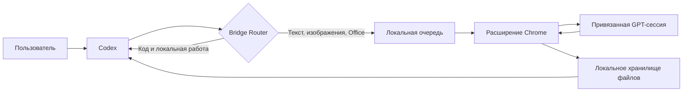

<p align="center">
  
</p>

<p align="center">
  <strong>Codex выполняет локальную работу, GPT решает сложные задачи с контентом.</strong><br />
  Локальный мост с изоляцией проектов, передачей файлов и восстановлением после сбоев.
</p>

<table align="center">
  <tr>
    <td width="50%" align="center"><strong>▣ Windows</strong><br /><a href="https://github.com/wangzhezbz/chatgpt-codex-bridge/releases/download/v0.1.95/CodexBridge-User-Package-v0.1.95-20260923-134443.zip">Скачать</a></td>
    <td width="50%" align="center"><strong>◇ macOS</strong><br /><a href="https://github.com/wangzhezbz/chatgpt-codex-bridge/releases/download/v0.1.95/CodexBridge-User-Package-v0.1.95-20260923-134443.zip">Скачать</a></td>
  </tr>
</table>

<p align="center">
  <a href="README.en.md">English</a> ·
  <a href="README.md">简体中文</a> ·
  <strong>Русский</strong> ·
  <a href="README.ja.md">日本語</a> ·
  <a href="README.ko.md">한국어</a>
</p>

## Зачем нужен chatgpt_codex_bridge

Codex хорошо читает проекты, изменяет код, запускает команды и проверяет результат. GPT удобнее для длинных текстов, планирования, визуальной оценки, изображений и документов Office. Без моста контекст и вложения приходится вручную переносить между двумя сессиями, а причину сбоя трудно определить.

- **Codex выполняет локальные операции:** код, файлы, терминал, тесты и развёртывание.
- **GPT выполняет ресурсоёмкую работу с контентом:** тексты, дизайн, изображения, Office/PDF и сложные вложения.
- **Маршрутизатор выбирает исполнителя:** пользователь может явно указать Codex или GPT.
- **Результат возвращается в тот же проект:** текст, изображения и файлы сохраняют область задачи.
- **Сбой можно восстановить:** повторно получить ответ или только недостающие вложения без повторной отправки завершённой задачи.

## Основные возможности

| Возможность | Описание |
|---|---|
| Привязка к проекту | Отдельная GPT-сессия, задача Codex и локальная папка для каждого проекта |
| Автоматическая маршрутизация | Codex-only, GPT-only и поэтапный GPT → Codex |
| Передача файлов | Текст, изображения, PDF, DOCX, XLSX, PPTX, ZIP и другие форматы |
| Проверка реального файла | Файловая задача успешна только после фактического получения файла |
| Несколько вложений | Получение нескольких файлов и дозагрузка только пропущенных |
| Устойчивый поиск ответа | Не зависит от одинакового текста и нестабильных позиций элементов |
| Восстановление после перезапуска | Продолжает ожидать существующую задачу GPT |
| Локальное хранение | Проекты, сообщения, задачи и файлы остаются в каталоге пользователя |
| Безопасная область | Останавливается при несовпадении страницы, проекта, версии или потока Codex |

## Архитектура



Система состоит из локального веб-интерфейса на `127.0.0.1:4317`, расширения Chrome, MCP-сервера для Codex и локального хранилища. Экспортировать cookie ChatGPT или отправлять проект на сторонний Bridge-сервер не требуется.

## Установка

### Требования

- Windows 10/11 или macOS, обе платформы проверены в реальной среде
- Node.js 20 или новее
- Codex Desktop или Codex CLI
- Chrome или другой Chromium-браузер
- Выполненный вход в ChatGPT

### Передайте готовый пакет в Codex — рекомендуемый способ

1. Откройте [Releases](https://github.com/wangzhezbz/chatgpt-codex-bridge/releases/latest) и скачайте `CodexBridge-User-Package-v0.1.95-*.zip`.
2. Прикрепите скачанный ZIP непосредственно к задаче Codex.
3. Отправьте вместе с файлом следующую инструкцию:

   ```text
   Установи этот пользовательский пакет chatgpt_codex_bridge: распакуй его в постоянную папку, размести каталог данных вне каталога установки, запусти локальный сервис, настрой и перезагрузи MCP Codex, затем проверь совпадение версий HTTP, MCP и расширения. Не удаляй и не перезаписывай существующие данные Bridge.
   ```

4. Codex выполнит распаковку, запуск и настройку MCP. Пользователю останется только загрузить расширение Chrome по инструкции ниже.

### Установка из исходного кода

```powershell
git clone https://github.com/wangzhezbz/chatgpt-codex-bridge.git
cd chatgpt-codex-bridge
npm install
npm start
```

### Расширение Chrome

1. Откройте `chrome://extensions/` и включите режим разработчика.
2. Нажмите **Загрузить распакованное расширение**.
3. Выберите папку `chrome-extension`.
4. Оставьте открытой GPT-сессию, которую хотите привязать.

<details>
<summary><strong>Дополнительно: ручная настройка MCP</strong></summary>

### Ручная настройка MCP для Codex

Добавьте в `~/.codex/config.toml`, заменив пути своими:

```toml
[mcp_servers.chatgpt-codex-bridge]
command = "node"
args = ["D:/Apps/CodexBridge/src/mcp-server.js"]
enabled = true

[mcp_servers.chatgpt-codex-bridge.env]
BRIDGE_DATA_DIR = "D:/CodexBridgeData"
BRIDGE_STORE = "D:/CodexBridgeData"
BRIDGE_ROUTER_V2 = "1"
BRIDGE_GPT_TRANSPORT = "web-sync"
```

Храните данные вне каталога приложения, чтобы обновление или откат не удалили проекты и историю. После сохранения перезагрузите MCP `chatgpt-codex-bridge`.

</details>

### Первая привязка

1. Откройте локальный проект в Codex.
2. Откройте веб-интерфейс Bridge.
3. Укажите имя проекта, URL GPT-сессии и локальную папку.
4. Нажмите кнопку привязки текущей сессии.
5. Убедитесь, что GPT привязан, соединение готово, а правила записаны.

## Использование

### Каждый день: привязка справа, запросы слева

1. Откройте нужный проект в Codex слева.
2. В Bridge справа введите имя проекта, ссылку на GPT-сессию и локальную папку, затем выполните привязку.
3. Когда правила записаны и соединение готово, вернитесь в Codex и сформулируйте запрос: `Попроси GPT проанализировать файл, затем измени проект по результатам.`

При привязке автоматически создаются или обновляются блоки Bridge в `AGENTS.md` и `BRIDGE.md` в папке проекта; существующие инструкции сохраняются. Для готовой привязки нажмите кнопку входа в списке проектов. Для каждого проекта используйте его собственную папку и GPT-сессию. Идентификаторы задач, проектов и scope — внутренние параметры, их не нужно вводить вручную.

- Обычные запросы отправляйте из веб-интерфейса; маршрутизатор выберет Codex или GPT.
- Анализ файла: `Передай этот PDF в GPT и перечисли основные проблемы.`
- Создание файла: `Создай таблицу Excel по этим данным и верни настоящий файл.`
- Поэтапная задача: `Сначала сделай план, затем первую главу, затем постер; выполняй по одному этапу.`
- Явный выбор: `Не отправляй это в GPT, выполни локально в Codex.`

### Восстановление

- **Повторно получить результат:** проверить исходный ответ без новой отправки.
- **Получить недостающие вложения:** сохранить полученные файлы и загрузить только пропущенные.
- **Отправить повторно:** только если исходный запрос действительно не был отправлен.
- **Остановить:** отменить текущую задачу без скрытой повторной отправки.

## Данные и безопасность

- Каталог данных задают `BRIDGE_DATA_DIR` и `BRIDGE_STORE`.
- Проект, GPT-сессия и поток Codex должны совпадать.
- Расширение получает задачи только на привязанной странице.
- Входные файлы и созданные результаты имеют разные области захвата.
- Состояние записывается атомарно с блокировкой и резервной копией.
- Не публикуйте cookie, токены, приватные файлы и данные `/api/config`.

## Обновление, откат и удаление

Распакуйте новую версию в отдельную папку, переключите MCP и расширение Chrome, сохранив прежний внешний каталог данных. Для отката верните старые пути. При удалении остановите сервис, удалите расширение и запись MCP, затем папку приложения; каталог данных удаляйте только намеренно.

## Устранение неполадок

| Проблема | Решение |
|---|---|
| Интерфейс не открывается | Проверьте сервис и доступность порта `4317` |
| Ожидание расширения | Перезагрузите расширение и откройте привязанную GPT-сессию |
| GPT закончил, результата нет | Сначала используйте повторный захват результата |
| Получена только часть файлов | Запустите получение недостающих вложений |
| MCP не видит проект | Сравните `dataRootId`, версию протокола и область проекта |
| Несовпадение версий | Перезагрузите сервис, расширение и MCP из одного выпуска |

## Разработка

```powershell
npm install
npm test
npm run acceptance:contract
npm run package:user
npm run package:embedded
```

[MIT](LICENSE) © 2026 chatgpt_codex_bridge contributors
