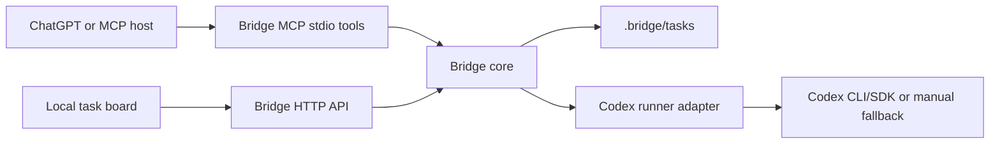

# ChatGPT Codex Bridge Design

## Goal

Build a local "B version" prototype inspired by Cowart: a browser task board plus narrow MCP tools that let ChatGPT create, inspect, and revise Codex execution tasks without giving ChatGPT arbitrary shell access.

## Scope

The first version runs as a local Node.js service from this repository. It stores durable task state under `.bridge/tasks/`, serves a local web UI on `127.0.0.1`, exposes JSON API routes for the UI, and exposes MCP tools over stdio for agent clients that can launch local MCP servers. ChatGPT remote access can be added later through an HTTPS tunnel or Apps SDK wrapper.

## Architecture

## Components

- `src/task-store.js`: owns task creation, listing, status transitions, event logging, and result files.
- `src/codex-runner.js`: owns execution policy. It supports safe manual mode by default and an opt-in Codex CLI mode via environment variables.
- `src/http-server.js`: serves the UI and JSON API.
- `src/mcp-server.js`: exposes narrow task tools to MCP hosts.
- `public/`: contains the task board UI.
- `tests/`: covers task store and runner behavior with Node's built-in test runner.

## Data Model

Each task lives in `.bridge/tasks/<task_id>/`:

- `task.json`: canonical status and metadata.
- `PROMPT.md`: prompt handed to Codex or copied by the user.
- `RESULT.md`: final runner output or manual fallback instructions.
- `events.ndjson`: append-only event stream for the task board.

Task statuses are `queued`, `running`, `waiting_for_codex`, `succeeded`, and `failed`.

## Safety

ChatGPT-facing tools cannot delete files, run arbitrary shell commands, or directly edit source. They can only create a task, list tasks, read task status, read task result, and request a revision. Codex execution is isolated behind the runner adapter. Automatic Codex CLI execution is disabled unless `BRIDGE_RUNNER=codex` is set.

## UX

The local page shows a dense task board for repeated use: task list on the left, selected task detail on the right, current status, prompt, result, and event log. The first screen is the usable app, not a landing page.

## Testing

Use `node --test`. The core TDD target is deterministic filesystem behavior: create task, persist prompt, append events, list newest tasks, run manual fallback, and write result state.
