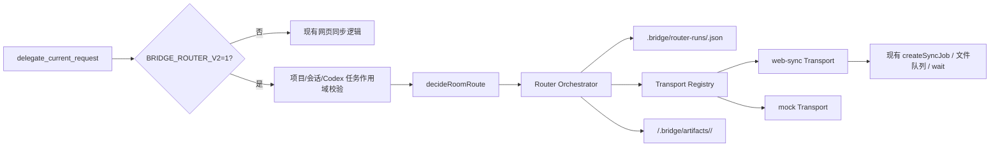

# CodexBridge Router 2.0 设计规格

## 1. 背景与目标

CodexBridge 当前以 `delegate_current_request` 为入口，把适合 GPT 的内容写入现有 Chrome 扩展同步队列。现有实现已经具备项目绑定、房间消息、网页同步任务、附件保存和项目副本能力，但多阶段创作只会生成并发送第一阶段，缺少可恢复的持久化编排。

Router 2.0 的目标是把 Bridge 升级为由 Codex 主导的任务编排器：Codex 负责本地代码、文件、终端、测试和验证；GPT 负责长文、设计、创意、图片、Office 文件和高成本内容分析；复合任务按依赖逐阶段提交，结果保存到明确绑定的项目并返回确定路径。

第一轮是旁路验证版，必须满足：

- `BRIDGE_ROUTER_V2` 默认关闭，关闭时 `delegate_current_request` 完整沿用旧逻辑。
- `BRIDGE_ROUTER_V2=1` 时才创建 Router Run 并走统一 GPT Transport。
- 默认 Transport 为 `web-sync`，继续使用现有 Chrome 网页链路和同步任务格式。
- `BRIDGE_GPT_TRANSPORT=mock` 可选择完全离线、无需 API Key 的 Mock Transport。
- 不接入 CCSwitch 私有 OAuth，不调用 ChatGPT 私有 `backend-api`，不读取浏览器 Cookie。
- 不改变旧 `chatgpt-artifacts` 行为；Router V2 只增加运行级产物目录。

## 2. 非目标

本轮不实现 OpenAI API、第三方模型 API 或 ChatGPT 桌面私有协议；不重写 Chrome 扩展状态机；不改变现有同步任务 JSON 的字段和领取规则；不让 Router 直接执行 Codex 本地任务；不增加全局自动领取或跨项目搜索。

## 3. 总体架构



模块边界如下：

- `transport-registry.js`：注册、校验和解析 Transport。选择优先级为显式调用参数、依赖注入、`BRIDGE_GPT_TRANSPORT`、默认 `web-sync`。
- `web-sync-transport.js`：把现有文本同步、附件分析、等待和失败终止能力映射为公共 Transport 协议；使用 Router 预分配的稳定 requestId 幂等创建 sync job，完整保留同阶段全部输入附件，Chrome 私有任务字段只放在 `raw`。
- `mock-transport.js`：不访问网络；按阶段注入结果；记录每次提交的序号、种类、payload 和时间。
- `router-run-store.js`：负责 Router Run JSON 的创建、读取、更新和三重作用域校验，并以进程内串行、跨进程锁文件和原子替换避免并发丢更新或截断 JSON；提交、成功产物终结和长编排操作使用彼此独立的租约。
- `router-orchestrator.js`：把路由结果转换为阶段，严格顺序提交、等待、持久化和保存项目产物。
- `bridge-tools.js`：保留旧实现，功能开关开启时调用 Orchestrator，并把结果适配回既有返回字段。

## 4. GPT Transport 公共协议

每个 Transport 必须提供：

```js
{
  id,
  submitText(input),
  submitArtifacts(input),
  wait(requestId, options),
  cancel(requestId, options)
}
```

四个操作返回统一信封，至少包含：

```js
{
  transportId,
  requestId,
  status,       // queued | running | succeeded | failed | cancelled
  replyText,
  artifacts,
  error,
  raw
}
```

公共层不得依赖 `syncJob.id`、`pending`、`errorCode` 等网页同步私有字段。`web-sync` 负责把 `pending` 映射为 `queued`，把成功、失败和超时映射为公共状态；原始消息、同步任务和等待结果可以保留在 `raw`，供 `bridge-tools.js` 兼容旧返回字段。

`cancel()` 不要求改造 Chrome 状态机。`web-sync` 可复用现有失败终止函数让任务不再被领取，并在公共协议中映射为 `cancelled`。

## 5. Router Run 数据模型

Router Run 写入 `<storeRoot>/router-runs/<runId>.json`；默认 `storeRoot` 为项目根下的 `.bridge`。

Run 至少保存：

```js
{
  id,
  version: 2,
  status,
  routeKind,
  syncKind,
  currentStageIndex,
  projectId,
  conversationId,
  codexThreadId,
  transportId,
  originalRequestText,
  targetRepo,
  chatgptProjectUrl,
  stages,
  projectArtifactPaths,
  createdAt,
  updatedAt
}
```

每个 stage 至少保存：

```js
{
  id,
  title,
  status,
  payloadText,
  dependsOn,
  replyText,
  artifactIds,
  transportRequestId,
  submissionState, // null | prepared | submitted
  inputArtifacts,
  projectArtifactPaths,
  startedAt,
  completedAt,
  error
}
```

未提交阶段状态为 `pending`；提交后按 Transport 状态保存；终态为 `succeeded`、`failed` 或 `cancelled`。Run 只有全部 GPT 阶段成功后才为 `succeeded`。任何失败、超时或取消都立即停止，不自动推进。

Run ID 和 stage ID 必须经过安全文件名校验，禁止路径穿越。更新在同一 Run 的进程内队列和跨进程锁内执行“读取、校验作用域、生成完整新对象、写临时文件、原子替换 JSON”；Windows 替换遇到短暂文件占用时有限重试，避免并发丢更新或进程中断留下截断文件。

## 6. 作用域隔离

Router V2 创建和继续运行都必须同时携带并匹配：

1. `projectId`
2. `conversationId`
3. `codexThreadId`（来自当前 `currentCodexThreadId`）

V2 不接受只依赖“当前活动项目”的模糊作用域。若调用同时提供 `projectId` 和 `conversationId`，两者必须指向同一项目。绑定项目缺少当前 Codex 任务 ID、目标仓库或 GPT 会话时，拒绝创建 GPT Run。

`continueRouterRun()` 和 `cancelRouterRun()` 读取 Run 后再次执行三重精确比较。任一字段缺失或不一致都拒绝操作，不允许其他项目、其他 GPT 会话或其他 Codex 任务领取或推进该 Run。

## 7. 编排规则

### 7.1 单阶段路由

- `codex_only`：可以记录一个不含 GPT 阶段的 Router Run，但绝不解析或调用 GPT Transport；返回既有 `codexPromptText`。
- `gpt_only`：创建一个 GPT 阶段，payload 使用 `route.gptPayloadText`。
- `gpt_then_codex`：先完成一个 GPT 阶段并保存结果；返回 `replyText` 和产物路径，供当前 Codex 任务继续本地落地。

### 7.2 多阶段创作

当 `route.sequentialPlan` 存在时，按其中顺序创建阶段。示例请求：

> 我要写一篇玄幻穿越小说。先设计前十集大纲，再写第一章，最后生成小说海报。

执行约束：

1. 第一次只提交 `outline`。
2. `outline` 成功并持久化后，才构造和提交 `chapter`；payload 必须包含大纲结果，并明确不得继续海报阶段。
3. `chapter` 成功并持久化后，才构造和提交 `poster`；payload 必须包含前序成功阶段的必要设定。
4. 原始三阶段请求不得原样附加到后续 payload，避免把未到阶段的任务再次发送。
5. `waitForGpt=true` 可在一次调用内循环推进，但每次仍只调用一次 `submitText()`，并在成功落盘后才进入下一次提交。
6. `waitForGpt=false` 只提交当前阶段。`continueRouterRun()` 先等待已提交请求；成功后最多提交下一阶段并返回，除非继续调用时显式要求等待到底。
7. 每个阶段在调用 Transport 前先生成稳定 `transportRequestId`，把 payload、输入附件和 `submissionState: "prepared"` 原子落盘；Transport 必须按该 ID 幂等创建底层任务，成功受理后再保存 `submissionState: "submitted"`。
8. 恢复时跳过所有 `succeeded` 阶段；`submitted` 阶段只调用 `wait()`。若进程中断在 `prepared` 窗口，使用原 requestId 和原 payload 幂等重试 submit，不得生成第二个底层任务。
9. 并发 `continueRouterRun()` 通过 operation lease 防止重复提交；“最终状态检查 → submit → 提交结果落盘”使用短 submission lease，成功结果的“产物物化 → 成功落盘”使用短 finalization lease。`transport.wait()` 不持有后两种租约，取消可抢占长等待。

多个彼此独立的输入附件由 Router 建立为受依赖约束的阶段，前一个成功后才提交下一个。若一个语义阶段（例如带参考资料的 `outline`）必须同时消费多份附件，web-sync 必须创建一个包含全部 `inputArtifacts` 的底层同步任务；禁止为每个文件各建任务后只跟踪第一项。

## 8. 项目产物

每个成功文本阶段写入：

```text
<targetRepo>/.bridge/artifacts/<runId>/<stageId>.md
```

Transport 返回的真实图片或文件必须先是现有 artifact-store 中的已保存 artifact，再从其确定的 `filePath` 复制到同一运行目录。文件名必须清理路径字符并避免覆盖；旧 `chatgpt-artifacts` 目录继续由现有流程维护。

Run、stage 和调用返回值都保存或返回绝对 `projectArtifactPaths`。Codex 后续只消费这些路径，不扫描磁盘、不猜测下载位置。

## 9. Bridge 接入与兼容返回

`createBridgeTools()` 读取 `options.routerV2Enabled`，未显式注入时再读取 `BRIDGE_ROUTER_V2 === "1"`。关闭时直接调用原有委派函数，不实例化 Router，不改变消息、同步任务、等待、超时或附件行为。

开启时：

1. 沿用现有 `resolveWorkspaceForInput()` 解析绑定项目。
2. 加强 V2 三重作用域校验。
3. 调用现有 `decideRoomRoute()`。
4. 选择 Transport 并调用 `startRouterRun()`。
5. 返回既有字段 `action`、`route`、`codexPromptText`、`gptPayloadText`、`message`、`syncJob`、`queuedFiles`、`artifacts`、`finalJob`、`timedOut`、`replyText`、`routingRules`，并新增 `routerRun`、`projectArtifactPaths` 和公共 `transportResult`。

新增 `continueRouterRun()` 与 `cancelRouterRun()` Bridge 方法，并在 MCP 层以新工具暴露；新工具不会修改任何既有工具参数。

## 10. 错误、超时、取消和恢复

- Transport 抛错：捕获后把当前 stage 和 run 标记为 `failed`，保存可序列化错误文本，再返回或重新抛出带 Run ID 的错误。
- 等待超时：使用现有 web-sync 超时终止结果，公共状态为 `failed`，不得推进。
- `cancelRouterRun()`：只取消当前已提交且未终止阶段；若 Transport 已经成功或失败，保留其真实终态，不得覆盖成取消。多阶段运行中，当前阶段已成功但取消已来迟时，保存该成功结果并取消下一个未开始阶段。
- prepared 请求在 Transport 中尚未出现时，取消必须等待同一 submission lease 并重新读取最新 Run；禁止取消先返回后又创建外部任务。wait/cancel 同时拿到成功结果时，finalization lease 保证产物只物化一次。
- web-sync 的完成、领取、发送标记与手动取消使用同一 sync-job 跨进程锁；第一个真实终态获胜。手动取消不得覆盖既有成功/真实失败，迟到完成也不得复活已手动取消任务。
- 进程恢复：从 JSON 读取；跳过成功阶段；对 `submitted` 阶段等待原 request；对 `prepared` 阶段用相同 requestId 幂等提交；只对第一个真正 `pending` 阶段生成新 requestId。
- 项目产物写入失败：当前 stage 视为失败，不把“GPT 已回复但项目路径未知”伪装成成功。

## 11. 测试策略

严格执行 RED-GREEN-REFACTOR：先创建测试并确认因模块或行为缺失而失败，再写最小实现。

- `gpt-transport-registry.test.js`：默认选择、环境选择、显式覆盖、注册校验、未知 Transport。
- `mock-gpt-transport.test.js`：离线提交、顺序记录、按阶段结果、artifact、失败和取消。
- `router-run-store.test.js`：JSON 持久化、完整字段、并发更新、三重作用域隔离、非法 ID。
- `router-orchestrator.test.js`：codex-only 零提交、单阶段、失败/取消不推进、恢复不重复、三阶段严格顺序、后续 payload 引用前序结果、精确项目产物路径。
- `bridge-tools.test.js`：功能开关关闭保持旧链路；开启调用 Router；项目、会话和 Codex 任务隔离；多附件与 prepared 文件重试；兼容返回字段。
- `mcp-server.test.js`：新增继续和取消工具可调用，既有工具名和 schema 不回归。

定向命令：

```powershell
node --test tests/gpt-transport-registry.test.js tests/mock-gpt-transport.test.js tests/router-run-store.test.js tests/router-orchestrator.test.js tests/bridge-tools.test.js
```

定向通过后运行 `npm test`，给予至少十分钟执行预算，并以当前新鲜输出为准。

## 12. 风险与后续

- `web-sync` 仍依赖浏览器扩展在线、页面状态和现有同步任务完成；Router 只隔离编排，不消除网页自动化固有不稳定性。
- 现有 sync-store 的领取隔离主要依赖项目 URL；Router Run 自身使用三重作用域，但本轮不重写 Chrome 领取协议。若未来允许同一 GPT URL 对应多个 conversation，需要单独升级扩展领取条件。
- Mock Transport 证明编排和持久化，不证明真实 GPT 的图片生成质量或网页捕获可靠性。
- 后续真实 API Transport 必须使用官方公开 API 和用户显式配置的 Key，继续遵守同一公共协议和作用域规则。
